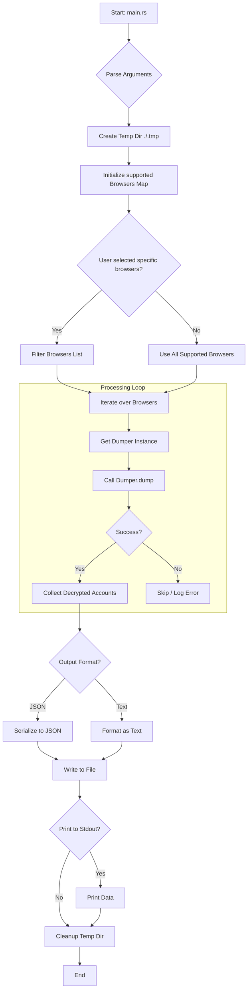
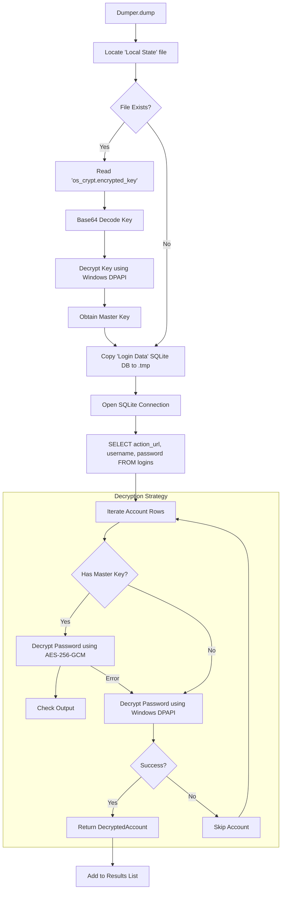

# Architecture Documentation

This document describes the high-level architecture and logic flow of `chrome-pwd-dumper-rs`, a Rust-based tool for dumping saved passwords from Chromium-based browsers on Windows.

## Overview

The application is a command-line interface (CLI) tool that interacts with browser data files (specifically `Local State` and `Login Data`) to extract and decrypt user credentials. It relies on Windows APIs (DPAPI) for key decryption and standard crypto libraries for AES-GCM decryption.

## Core Modules

*   **`main.rs`**: Entry point. Handles argument parsing, orchestration of the dumping process, and output generation.
*   **`dumper.rs`**: implementation of the `Dumper` struct. Responsible for locating browser files, querying the SQLite database, and managing the decryption workflow for a specific browser.
*   **`decryption_core.rs`**: Low-level cryptographic primitives. Wraps Windows DPAPI (`CryptUnprotectData`) and implements AES-256-GCM decryption.
*   **`models.rs`**: Data structures defining the schema for raw browser data (`ChromeAccount`, `LocalState`) and the final output (`DecryptedAccount`).
*   **`args.rs`**: Command-line argument definition using `argh`.

## Application Flow

### 1. High-Level Execution Flow

The following diagram illustrates the lifecycle of the application from execution to termination.

### 2. Dumping and Decryption Logic

This diagram details the internal logic within `Dumper.dump()`, showing how keys are retrieved and how passwords are decrypted depending on the Chrome version mechanism (pre or post v80).

## Key Components Detail

### Browser Detection
The tool uses a predefined list of `AppInfo` structures mapping known browser names (e.g., "Chrome", "Edge", "Brave") to their expected directory paths within the user's `AppData`.

### Cryptography
1.  **Master Key (Chrome v80+)**:
    *   Chrome stores a master key in the `Local State` JSON file.
    *   This key starts with `DPAPI` and is encrypted using Windows DPAPI.
    *   The tool decrypts this key using `CryptUnprotectData`.
    *   The resulting *Master Key* is used to decrypt the actual passwords.

2.  **Password Decryption**:
    *   **Modern (v80+)**: Passwords are encrypted with AES-256-GCM. The initialization vector (IV) is extracted from the password field (bytes 3-15), and the payload follows. The *Master Key* is used for this decryption.
    *   **Legacy**: Passwords were directly encrypted using DPAPI. The tool attempts this if no Master Key is found or as a fallback.
